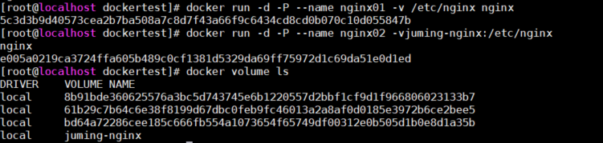

# 0x01 如何在Docker Hub上进行提交

```shell
# docker commit [OPTIONS] CONTAINER [REPOSITORY[:TAG]]

docker commit -a="sitong" -m="add webapps app" 58e2a tomcat01:1.0    # 提交修改过后的镜像，58e2a是容器ID
docker images    # 查看tomcat01镜像

# 修改ENV内容
docker commit --change "ENV DEBUG=true" c3f279d17e0a  svendowideit/testimage:version3
```

| Name               | 默认值 | Description                                                |
| ------------------ | ------ | ---------------------------------------------------------- |
| `--author` , `-a`  |        | Author (e.g., "John Hannibal Smith <hannibal@a-team.com>") |
| `--change` , `-c`  |        | Apply Dockerfile instruction to the created image          |
| `--message` , `-m` |        | Commit message                                             |
| `--pause` , `-p`   | `true` | Pause container during commit                              |

# 0x02 如何在Docker中使用存储卷

内容可以参考：[docker从零开始 存储（二）volumes 挂载](https://www.cnblogs.com/benjamin77/p/9512537.html)

官方讲解参见：[Use volumes](https://docs.docker.com/storage/volumes/)

## 使用容器数据卷

容器数据的持久化和同步操作，容器间也可以数据共享。

```shell
# docker run -v `localPwd`:`dockerPwd` -w `pwd` -i -t  ubuntu pwd

# 直接使用 -v 挂载
docker run -it -d -v /home/dockertest:/home centos
ls /home/dockertest    # 此时文件夹为空

# 进入容器添加文件
docker attach f7cb
cd /home
touch temp.file
exit

# 到本机查看新添的文件
ls /home/dockertest    # 此时文件夹内由temp.file文件
docker inspect f7cb
```


其中Source为主机地址，Destination为Docker内地址。

## MySQL映射目录实验


```shell
docker run -d -p 3310:3306 \
    -v /home/mysql/conf:/etc.conf.d \
    -v /home/mysql/data:/var/lib/mysql \
    -e  MYSQL_ROOT_PASSWORD=123456 --name mysql01 mysql5.7

# 删除后，依然可以看到镜像挂载过的文件
docker rm $mysql_ID
docker ps -a
cd /home/mysql/data
```

## 具名挂载与匿名挂载

```shell
# 匿名挂载，未设定容器外目录位置
docker run -d -P --name nginx01 -v /etc/nginx nginx
# 具名挂在，设定挂载名为juming-nginx
docker run -d -P --name nginx02 -v juming-nginx:/etc/nginx nginx
docker volume ls 
docker volume inspect juming-nginx
```

`docker volume ls`命令执行结果：



`docker volume inspect juming-nginx`命令执行结果：


docker容器内的卷，在未指定目录情况下，都是挂载在`/var/lib/docker/volumes/$volumes_name/_data`


```shell
# 如何确定具名挂载还是匿名挂载
-v 容器内路径            # 匿名挂载
-v 卷名:容器内路径            # 具名挂载
-v /宿主机路径:容器内路径    # 指定路径挂载
```

此外还可以设定挂载卷的read-only属性，设定之后，挂载路径的内容只可以被宿主机修改

```shell
docker run -d -P --name nginx02 -v juming-nginx:/etc/nginx:ro nginx
docker run -d -P --name nginx02 -v juming-nginx:/etc/nginx:rw nginx
docker run -d -P --name nginx02 --read-only -v juming-nginx:/etc/nginx nginx
```

> Volumes can be used in combination with `--read-only` to control where a container writes files. The `--read-only` flag mounts the container’s root filesystem as read only prohibiting writes to locations other than the specified volumes for the container.

## 通过Dockerfile挂载文件

Dockerfile是用于构建docker的文件，[构建文档](https://docs.docker.com/engine/reference/builder/) & [官方最佳实践](https://docs.docker.com/develop/develop-images/dockerfile_best-practices/)。

通过Dockerfile可以生成镜像，镜像是一层一层的，脚本的一个一个命令，每个命令都是一层。

```shell
# 创建文dockerfile件
vim df01
# 将以下内容输入文件
FROM centos
VOLUME ["/home/volume01","/home/volume02"]
CMD echo "---end---"
CMD /bin/bash
# 回到命令行使用dockerfile创建容器
docker build -f ./df01 -t test/centos:1.0 .
docker images
```


## 多个MySQL同步数据

如果要从centos01中的MySQL将数据共享到centos02中MySQL，则centos01可被称为**父容器**。

```shell
# 连续启动三个容器
docker run -it --name docker01 dftest/centos:1.0
docker run -it --name docker02 --volumes-from docker01 dftest/centos:1.0
docker run -it --name docker03 --volumes-from docker01 dftest/centos:1.0

# 进入docker01，修改volume02中内容
docker attach docker01
ls /home/volume02    # 此时文件夹内无内容
vi /home/volume02/docker01File
# 添加内容：docker01 write this line并退出
# 退出并关闭docker01
exit
# 观察docker02和docker03中volumes02内容
docker attach docker02
# docker01 关闭后，volume02内依然存在docker01File
ls /home/volume02
```

实际上使用`docker inspect docker01`和`docker inspect docker02`分别观察两个容器的数据卷挂载后，就可以发现，`volume01`和`volume02`在宿主机中实际上共用了同一个物理位置。而这样的位置引用可以保证，除非使用`docker rm`删除了所有挂载该volume的容器，否则该位置将会一直存在，否则即使删除了`docker01`，`docker02`和`docker03`之间依然可以通过该文件夹同步数据。

对于重要的文件，只要第一次挂载时，通过-v挂载到本地，就可以永远存在。

同理可以启动多个MySQL进行同步：

```shell
docker run -d -p 3001:3306 --name mysql01 -v /etc/mysql/conf.d -v /var/lib/mysql -e MYSQL_ROOT_PASSWORD=123456 mysql:5.7
docker run -d -p 3302:3306 --name mysql02 --volumes-from mysql01 -e MYSQL_ROOT_PASSWORD=123456 mysql:5.7
docker run -d -p 3303:3306 --name mysql03 --volumes-from mysql01 -e MYSQL_ROOT_PASSWORD=123456 mysql:5.7
```

# Dockerfile

## 命令

- `FROM`FROM 指定基础镜像，目的是为了给构建镜像提供一个基础环境
- `MINTAINER`指定维护者信息
- `RUN`基于FROM指定的docker镜像运行一个指令，将结果反映到新生成的镜像。RUN指令后面执行的命令必须是镜像中已经存在了的命令。
- `ADD`将本地文件添加到镜像
    - 支持自动解压，但是仅仅支持解压tar包
    - 支持远程下载，但是不会解压下载内容
- `WORKDIR` 设置工作目录
    - 程序运行的开始目录
    - 进入容器的最初目录

- `VOLUME` 提示需要挂载的目录，没有实现挂载

- `EXPOSE`    指定容器需要向外界暴露的端口，实际上没有暴露，只有指定了EXPOSE才能够使用-P, 可以指定多个端口

- `CMD`**The main purpose of a `CMD` is to provide defaults for an executing container.** These defaults can include an executable, or they can omit the executable, in which case you must specify an `ENTRYPOINT` instruction as well.

    - exec form

        ```dockerfile
        CMD ["executable","param1","param2"]
        ```

    - default parameters to ENTRYPOINT

        ```dockerfile
        CMD ["param1","param2"]
        ```

    - shell form

        ```dockerfile
        CMD command param1 param2
        ```

- `ARG`指定运行时参数，用于构建docker镜像时传入参数

- `ENTRYPOINT`An `ENTRYPOINT` allows you to configure a container that will run as an executable.

    - exec form

        ```dockerfile
        ENTRYPOINT ["executable", "param1", "param2"]
        ```

    - shell form

        ```dockerfile
        ENTRYPOINT command param1 param2
        ```

        

- `ONBUILD`ONBUILD后面跟的是Dockerfile指令不是Linux命令。作为 **构建触发器** 当前镜像被用作基础镜像时触发

- `COPY` 类似于ADD，将文件拷贝进入镜像

- `ENV`设置环境变量

- `LABEL`:The `LABEL` instruction adds metadata to an image. A `LABEL` is a key-value pair. To include spaces within a `LABEL` value, use quotes and backslashes as you would in command-line parsing.

测试去构建一个镜像，DockerHub中大部分镜像都是从基础镜像`scratch`开始的。

```shell
# 编写Dockerfile文件
mkdir /home/dockerfile
vim mydockerfile

# 下面是mydockerfile内容
FROM centos
MAINTAINER xsj<mail.com>
ENV MYPATH /usr/local
WORKDIR $MYPATH

RUN yum -y install vim
RUN yum -y install net-tools

EXPOSE 80

CMD echo $MYPATH
CMD echo"---end---"
CMD /bin/bash

# 构建镜像
docker build -f mydockerfile -t mycentos:0.1 .
```

## History

通过历史查看镜像生成命令

```shell
docker history $Image_ID
```

## CMD & ENTRYPOINT

参考文章1：[Docker学习之Dockerfile:CMD与ENTRYPOINT](https://blog.csdn.net/wuce_bai/article/details/88997725)

参考文章2：[【docker】CMD ENTRYPOINT 区别 终极解读！](https://blog.csdn.net/u010900754/article/details/78526443)

官方文档：[Understand how CMD and ENTRYPOINT interact](https://docs.docker.com/engine/reference/builder/#understand-how-cmd-and-entrypoint-interact)

docker run时，如果需要执行一些指令，有三种方式，CMD、ENTRYPOINT、docker run后面加参数。

而linux中执行命令有两种方式，shell和exec模式，CMD和ENTRYPOINT对于这两种模式都有对应的编写方式，参考上文。

CMD是默认执行参数，如果docker run后面有参数，会覆盖CMD中内容。ENTRYPOINT是容器开启后的入口程序，是一定会执行的，如果docker run后面加了参数，会被当做ENTRYPOINT中程序参数添加执行。

## tomcat镜像实战

准备文件

```shell
mkdir tomcat_df
wget "https://archive.apache.org/dist/tomcat/tomcat-9/v9.0.22/bin/apache-tomcat-9.0.22.tar.gz"
wget "https://download.oracle.com/otn/java/jdk/8u11-b12/jdk-8u11-linux-x64.tar.gz"
# 简单编写readme文件
vim readme.txt
# 编写Dockerfile
vim Dockerfile
```

编写Dockerfile

```dockerfile
# 将文件命名为Dockerfile
FROM centos
MAINTAINER xsj<temp@mail.com>

COPY readme.txt /usr/local/readme.txt

ADD jdk-8ull-linux-x64.tar.gz /usr/local/
ADD apache-tomcat-9.0.22.tar.gz /usr/local/

RUN yum -y install vim

ENV MYPATH /usr/local
WORKDIR $MYPATH

ENV JAVA_HOME /usr/local/jdk1.8.0_11
ENV CLASSPATH $JAVA_HOME/lib/dt.jar:$JAVA_HOME/lib/tool.jar
ENV CATALINA_HOME /usr/local/apache-tomcat-9.0.22
ENV CATALINA_BASH /usr/local/apache-tomcat-9.0.22
ENV PATH $PATH:$JAVA_HOME/bin:$CATALINA_HOME/lin:$CATALINA_HOME/bin

CMD /usr/local/apache-tomcat-9.0.22/bin/startup.sh && tail -F /usr/local/apache-tomcat-9.0.22/bin/log/catalina.out
```

创建并启动容器

```shell
# 创建镜像并运行容器
docker build -t diy-tomcat .
docker run -d -p 9090:8080 --name test-tomcat \
    -v /home/tomcat_df/test:/usr/local/apache-tomcat-9.0.22/webapps/test/ \
    -v /home/tomcat_df/tomcatlogs/:/usr/local/apache-tomcat-9.0.22/logs diy-tomcat
    
# 创建并发布一个项目
cd test
mkdir WEB-INF
cd WEB-INF/
vim web.xml
cd ../
vim index.jsp
```

将下面XML文件拷贝进入`web.xml`

```xml
<?xml version="1.0" encoding="UTF-8"?>
<web-app 
         xmlns:xsi="http://www.w3.org/2001/XMLSchema-instance" 
         xmlns="http://java.sun.com/xml/ns/javaee" 
         xsi:schemaLocation="http://java.sun.com/xml/ns/javaee 
                             http://java.sun.com/xml/ns/javaee/web-app_2_5.xsd" 
         version="2.5">
</web-app>
```

将下面文件拷贝进入`index.jsp`

```jsp
<%@ page language="java" contentType="text/html; charset=UTF-8"
    pageEncoding="UTF-8"%>
<!DOCTYPE html>
<html>
<head>
<meta charset="utf-8">
<title>first docker website</title>
</head>
<body>Hello World!<br/>
<%
System.out.println("----test web logs----)";
%>
</body>
</html>
```

此时已经可以在外部访问，同时可以通过下述命令查看log

```shell
tail /home/tomcat_df/tomcatlogs/catalina.out
```

## 发布镜像

发布到Docker Hub上

```shell
docker login -u username
docker images    # 找到自己的镜像
# push镜像需要带上版本信息，
docker tag $image_id $new_tag:$version
docker push $new_tag:$version
docker logout
```

发布到阿里云上（需要到网站手动操作）

1. 创建命名空间
2. 创建镜像仓库，建议设为私有
3. 浏览阿里云镜像信息
4. 使用阿里云发布镜像（参见官方教程）

```shell
docker login -u $username registry.cn-beijing.aliyuncs.com
docker pull $image_url
```

## 导出Container：save & load

内容介绍

> Docker Save: Save one or more images to a tar archive (streamed to STDOUT by default)
>
> Docker Load: Load an image from a tar archive or STDIN

使用说明

```shell
# docker save [OPTIONS] IMAGE [IMAGE...]
# --output , -o        Write to a file, instead of STDOUT
docker save busybox > busybox.tar

# docker load [OPTIONS]
# --input , -i        Read from tar archive file, instead of STDIN
# --quiet , -q        Suppress the load output
docker load < busybox.tar.gz
docker load --input fedora.tar
```

## 导出Image：export & import

- export：Export a container's filesystem as a tar archive

    ```shell
    # docker export [OPTIONS] CONTAINER
    # --output , -o        Write to a file, instead of STDOUT
    docker export red_panda > latest.tar
    ```

- import：Import the contents from a tarball to create a filesystem image

    ```shell
    # docker import [OPTIONS] file|URL|- [REPOSITORY[:TAG]]
    # --change , -c        Apply Dockerfile instruction to the created image
    # --message , -m        Set commit message for imported image
    # --platform        API 1.32+ Set platform if server is multi-platform capable
    docker import http://example.com/exampleimage.tgz
    cat exampleimage.tgz | docker import - exampleimagelocal:new
    ```

# Docker网络

## veth-pair技术

OpenStack,Docker,OVS

## Docker0

Docker0 就是Docker本身的地址，可以视作众多容器之间一个公共的路由器。

Docker0与各个容器之间，使用veth-pair技术连接。容器删除后，veth-pair自动取消。

Docker0与物理网卡之间使用NAT连接。


## 替代动态容器IP（--link）

是在容器内部使用IP映射来做，已不建议使用。

```shell
# 建立两个docker并让02连接01网络
docker run -d -P --name tomcat01 tomcat:latest
docker run -d -P --name tomcat02 --link tomcat01 tomcat:latest
docker exec -it tomcat02 ping tomcat01

# 但是如下的反向连接不行
docker exec -it tomcat01 ping tomcat02 

# 查看Docker网络
docker network ls
docker network inspect $networkID

# 查看tomcat02与tomcat01的连接
docker exec -it tomcat02 cat /etc/network
```

## 自定义网络（docker network）

## 网络模式分析

- bridge：桥接docker（建议使用）
- none：不配置网络
- host：和宿主机处于同一个网络
- container：容器网络互联（不建议使用）

## 网络模式配置测试

```shell
# net默认是处于bridge模式，容器之间无法连接
docker run -d -P --name tomcat01 --net bridge tomcat

# 创建一个自定义子网mynet
docker network create --driver bridge --subnet 192.168.0.0/16 --gateway 192.168.0.1 mynet
docker network ls

# 向子网中添加容器
docker run -d -P --name tomcat-net-01 --net mynet tomcat:latest
docker run -d -P --name tomcat-net-02 --net mynet tomcat:latest

# 此时内网机器已经可以互相连接
docker exec -it tomcat-net-01 ping tomcat-net-02 
```

## 网络联通

不同docker网络下的服务器无法互相连接的问题。


```shell
# 将tomcat01添加到mynet中
docker network connect mynet tomcat01
docker network inspect mynet
docker exec -it tomcat01 ping tomcat-net-01
```

此时`tomcat01`就有了两个IP地址

## 部署redis集群

1. 集群架构并构建Redis网络

  三台主服务器：redis-master-(01-03)

  三台备用服务器：redis-slave-(01-03)

  ```shell
  docker network create redis --subnet 172.38.0.0/24
  ```

2. 自动生成

    ```shell
    for port in $(seq 1 6); \
    do \
    mkdir -p /mydata/redis/node-${port}/conf
    touch /mydata/redis/node-${port}/conf/redis.conf
    cat << EOF >/mydata/redis/node-${port}/conf/redis.conf
    port 6379 
    bind 0.0.0.0
    cluster-enabled yes 
    cluster-config-file nodes.conf
    cluster-node-timeout 5000
    cluster-announce-ip 172.38.0.1${port}
    cluster-announce-port 6379
    cluster-announce-bus-port 16379
    appendonly yes
    EOF
    done
    ```

3. 启动服务

    ```shell
    for port in $(seq 1 6); \
    do \
    docker run -p 637${port}:6379 -p 1637${port}:16379 --name redis-${port} \
        -v /mydata/redis/node-${port}/data:/data \
        -v /mydata/redis/node-${port}/conf/redis.conf:/etc/redis/redis.conf \
        -d --net redis --ip 172.38.0.1${port} redis:5.0.9-alpine3.11 redis-server /etc/redis/redis.conf
    done
    ```

4. 进入节点

    ```shell
    docker exec -it redis-1 /bin/sh
    ```

5. 创建集群

    ```shell
    redis-cli --cluster create \
        172.38.0.11:6379 \
        172.38.0.12:6379 \
        172.38.0.13:6379 \
        172.38.0.14:6379 \
        172.38.0.15:6379 \
        172.38.0.16:6379 \
        --cluster-replicas 1
    ```

    如有失败，可使用如下命令关闭，并删除所有redis容器

    ```shell
    docker stop `docker ps -a | grep redis | awk '{print $NF}'`
    docker rm `docker ps -a | grep redis | awk '{print $NF}'`
    ```

6. 查看同步效果

    - 查看Cluster配置

        

        

    - 存入数据并查看存放位置，之后下线存放节点，验证高可用（红色指针位置，在另一个终端下线了Redis-3节点）

        

---

## Reference

- [Docker入门指南](http://www.uml.org.cn/yunjisuan/201509023.asp?artid=16908)
- [Docker Config: IPv4 Forwarding is Disabled](https://stackoverflow.com/questions/41453263/docker-networking-disabled-warning-ipv4-forwarding-is-disabled-networking-wil)
- [云原生Docker进阶教程](https://www.kuangstudy.com/course/cplay/1713520123123777537)

