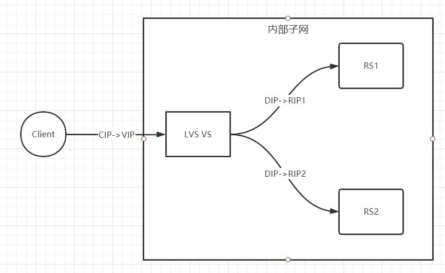
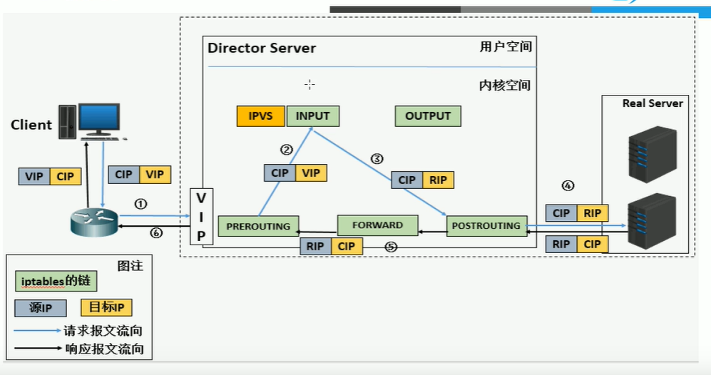

# 2021-08-02-LVS学习

## Cluster基础

### 会话保持问题

1. session sticky 同一用户调度到固定服务器

	- Source IP：LVS中sh算法（对某一特定服务）
	- Cookie：

2. session replication 每台服务器都拥有全部session

	session multicast cluster

3. session server 设置专门的session服务器

	Memcached、Redis

### HA集群解决方案

1. keepalived：VRRP协议
2. AIS 应用接口规范（基本淘汰）
	- heartbeat
	- cman+rgmanager（RHCS，红帽解决方案）
	- coresync_pacemaker

## LVS介绍

内核直接支持，官网较少信息，后期由Linux团队负责开发。工作原理是，VS根据请求报文的目标IP和目标协议及端口将其调度转发至RS，根据调度算法选择RS。

### iptables & netfilter

iptables：用户空间的管理工具

netfilter：内核空间的管理框架

流入：PreRouting--Input

流出：Output--PostRouting

转发：PerRouting--Forward--PostRouting

DNAT：目标地址转换；PreRouting

### VS & RS

Visual Server[VS] = Director Server[DS] = Dispatcher = Load Balancer

[LVS]Real Server[RS] = [Nginx]upstream server = [haproxy]backend server

| 缩写 | 全称                            |
| ---- | ------------------------------- |
| CIP  | Client IP                       |
| VIP  | Virtual Server IP（VS外网的IP） |
| DIP  | Director IP（VS内网的IP）       |
| RIP  | Real Server IP                  |

访问流程：CIP <--> VIP == DIP <--> RIP

### LVS工具集

ipvsadm：用户空间的命令行工具，规则管理器、

ipvs：工作于内核空间netfilter的INPUT钩子上的框架，截取内核获得的INPUT信息，直接转发


### LVS集群类型

| 集群类型    | 解释                                                         |
| ----------- | ------------------------------------------------------------ |
| lvs-nat     | 修改请求报文的目的IP，多目标IP的DNAT<br />（iptables其实相当于单目标IP的DNAT） |
| lvs-dr      | 操纵封装的 MAC 地址                                          |
| lvs-tun     | 在原请求报文之外新加一个IP首部                               |
| lvs-fullnat | 修改请求报文的源目的IP                                       |

一个转发实例：一台LVS与两台RS的模型



**【lvs-nat】**本质是多目标IP的DNAT，通过将请求报文中目标地址和目标端口修改为被选定的RS的RIP和PORT实现转发

- RIP和DIP应当在同一个IP网络（此时使用交换机即可、无需路由器），且使用私网地址，RS的网关要指向DIP
- 请求报文和响应报文都需要经过Director来转发（因为Director中存有DIP转换表，RS无法知道同Client建立连接的DIP，故无法与Client通信）Director容易成为系统瓶颈
- 支持端口映射，可以修改报文目标的Port
- VS（LVS服务器）必须是Linux系统，RS可以是任意系统（只需要暴露服务接口即可）



【**lvs-dr**】Direct Routing，直接路由模式，LVS默认模式，对请求报文重新封装一个MAC首部进行转发，源MAC是DIP所在的接口MAC，目标MAC是RIP的MAC，源目的IP-PORT都不变。

- Director和RS都配置有VIP

- 确保前端路由器将DstIP为VIP的发往Director

	- 前端网关静态绑定VIP和Director的MAC地址

	- 在RS配置arptables

		```shell
		arptables -A IN -d $VIP -j DROP
		arptables -A OUT 0s $VIP -j mangle --mangle-ip-s $RIP
		```

	- 在RS上修改后面两个内核参数以限制RS的arp通告及应答级别

		- `/proc/sys/net/ipv4/conf/all/arp_ignore`
		- `/proc/sys/net/ipv4/conf/all/arp_announce`

	

| 时间 | Src IP | Src MAC     | Dst IP | Dst MAC     |
| ---- | ------ | ----------- | ------ | ----------- |
| T1   | CIP:XX | MAC_Client  | VIP:80 | MAC_Route1  |
| T2   | CIP:XX | MAC_Route2  | VIP:80 | MAC_LVS     |
| T3   | CIP:XX | MAC_LVS     | VIP:80 | MAC_RS1     |
| T4   | VIP:80 | MAC_RS1     | CIP:XX | MAC_Router2 |
| T5   | VIP:80 | MAC_Router1 | CIP:XX | MAC_Client  |