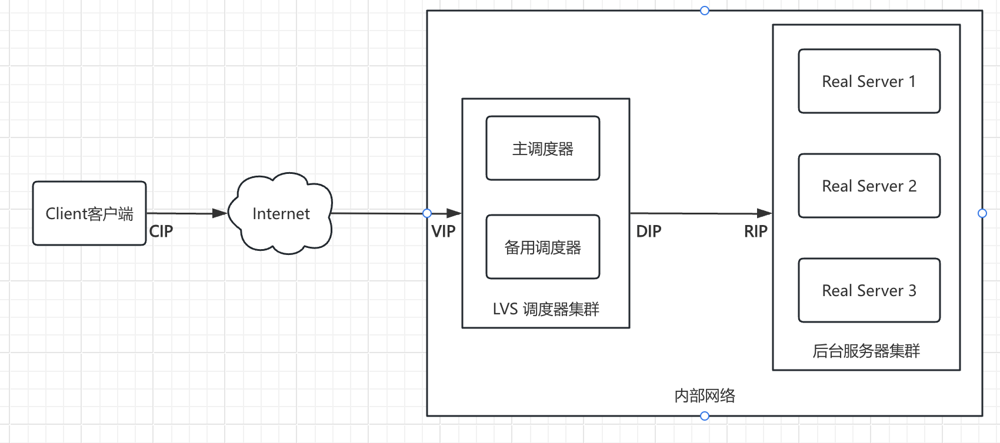
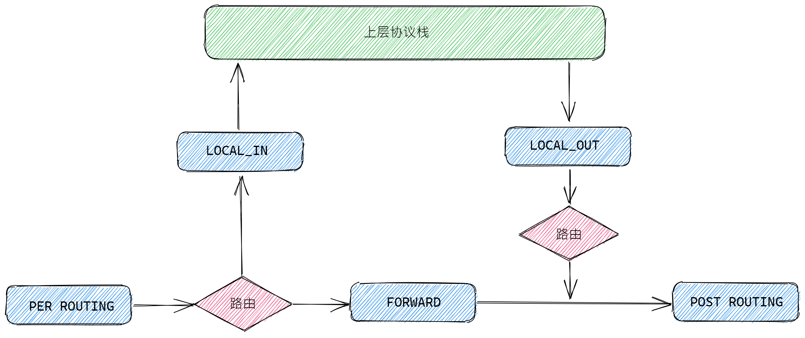

# 0x01 负载均衡

Web 服务中越来越多地使用 CGI、动态主页等 CPU 密集型应用，需要服务器具有更强的 CPU 和 I/O 处理能力。例如，通过 HTTPS（Secure HTTP）取一个静态页面需要的处理性能比通过 HTTP 的高一个数量级。需求可以归纳为：

- **可伸缩性（Scalability）**，当服务的负载增长时，系统能被扩展来满足需求，且不降低服务质量。
- **高可用性（Availability）**，尽管部分硬件和软件会发生故障，整个系统的服务必须是每天24小时每星期7天可用的。
- **可管理性（Manageability）**，整个系统可能在物理上很大，但应该容易管理。

## 1. SLB 种类

- 第四层（传输层）：根据目标端口转发（DPORT），LVS，Nginx，haproxy(tcp mode)
- 第七层（应用层）：根据特定协议转发，
  - HTTP：Nginx，httpd，haproxy(http mode)
  - fastcgi：Nginx，httpd
  - MySQL：[mysql-proxy](https://github.com/mysql/mysql-proxy)

## 2. LVS 实现方案

**基于网络地址转换的虚拟服务器 Virtual Server via Network Address Translation（VS/NAT）** 通过网络地址转换，调度器**重写请求报文的目标地址**，根据预设的调度算法，将请求分派给后端的真实服务器；真实服务器的响应报文通过调度器时，报文的源地址被重写，再返回给客户，完成整个负载调度过程。

**基于IP隧道的虚拟服务器 Virtual Server via IP Tunneling（VS/TUN）** 采用NAT技术时，由于请求和响应报文都必须经过调度器地址重写，当客户请求越来越多时，调度器的处理能力将成为瓶颈。为了解决这个问题，**调度器把请求报文通过IP隧道转发至真实服务器，而真实服务器将响应直接返回给客户**，所以调度器只处理请求报文。由于一般网络服务应答比请求报文大许多，采用 VS/TUN技术后，集群系统的最大吞吐量可以提高10倍。

**基于直连技术的虚拟服务器 Virtual Server via Direct Routing（VS/DR）** VS/DR通过**改写请求报文的MAC地址，将请求发送到真实服务器**，而真实服务器将响应直接返回给客户。同VS/TUN技术一样，VS/DR技术可极大地提高集群系统的伸缩性。这种方法没有IP隧道的开销，对集群中的真实服务器也没有必须支持IP隧道协议的要求，**但是要求调度器与真实服务器都有一块网卡连在同一物理网段上**。

# 0x02 负载均衡特性

## 1. 请求调度 Load Balancing

IPVS 在内核中的负载均衡调度是以**连接**为粒度的。在 HTTP 协议（非持久）中，每次从 Web 服务器上获取资源都需要建立一个 TCP 连接，同一用户的不同请求会被调度到不同的服务器上，所以这种细粒度的调度在一定程度上可以避免单个用户访问的突发性引起服务器间的负载不平衡。

LVS 分为两种调度方式：**静态调度** 和 **动态调度**:

**静态调度方式** 是指不需要 RS 反馈繁忙程度，根据调度算法计算目标 RS。

- **轮询调度**（Round-Robin Scheduling，rr）
- **加权轮询调度**（Weighted Round-Robin Scheduling，wrr），按照权重比例作为轮询标准。
- **目标地址散列调度**（Destination Hashing Scheduling，dh），目标地址哈希，对于同一目标 IP 的请求总是发往同一服务器。
- **源地址散列调度（Source Hashing Scheduling，sh）**，源地址哈希，在一定时间内，只要是来自同一个客户端的请求，就发送至同一服务器。

**动态调度方式** 是指需要 RS 反馈繁忙程度，根据 RS 反馈，计算出下一个目标 RS。

- **最小连接调度**（Least-Connection Scheduling，lc），调度器需要记录各个服务器已建立连接的数目，当一个请求被调度到某服务器，其连接数加 1；当连接中止或超时，其连接数减 1。当各个服务器的处理能力不同时，该算法不理想。
- **加权最小连接调度**（Weighted Least-Connection Scheduling，wlc）
- **基于本地的最少连接**（Locality-Based Least Connections Scheduling，lblc），目前该算法主要用于 cache 集群系统。
- **带复制的基于局部性最少连接**（Locality-Based Least Connections with Replication Scheduling，lblcr），目前主要用于 Cache 集群系统。

## 2. 会话保持 Persistence Handling

对于一些特定应用，保证属于同一客户的请求落到同一后端服务器非常重要。这可能需要考虑缓存、结构复杂的临时状态等问题。**会话（Session）** 的定义也并不相同，可能会包括 HTTP cookies、客户端连接特性（properties），或者其他一些属性。

## 3. 存活检测 Healthy Check

健康检查是负载均衡器判断它的后端是否可以接收请求的过程。大致分为两类：

1. keepalived： VRRP协议
2. AIS 应用接口规范（基本淘汰）
   - heartbeat
   - cman+rgmanager（RHCS，红帽解决方案）
   - coresync_pacemaker

## 4. 服务发现 

服务发现是负载均衡器判断它有哪些可用后端的过程。用到的方式差异很大，这里给出几个例子：

- 静态配置文件:
- DNS：
- Zookeeper, Etcd, Consul 等待
- Envoy 的通用数据平面 API

# 0x03 负载均衡模型

## 1. SLB术语与架构



LVS的模型中有两个角色：

- 调度器：`Director`，又称为`Dispatcher`，`Balancer`，**主要用于接受用户请求**。
- 真实主机：`Real Server`，简称为 `RS`，**主要用于真正处理用户的请求**。

一个LVS服务模型中通常会包括四类IP：

- `VIP`：向外部直接面向用户请求，作为用户请求的目标的IP地址
- `DIP`：Director Server IP，主要用于和内部主机通讯的IP地址
- `RIP`：Real Server IP，后端服务器的IP地址
- `CIP`：Client IP，访问客户端的IP地址

一个标准请求的访问流程顺序为：`CIP` => `VIP` => `DIP` => `RIP`

## 2. LVS 工具集

ipvsadm：用户空间的命令行工具，规则管理器、

ipvs：工作于内核空间netfilter的INPUT钩子上的框架，截取内核获得的INPUT信息，直接转发

# 0x04 LVS 底层原理

在介绍 `LVS` 的实现前，我们需要了解以下 `Netfilter` 这个功能，因为 `LVS` 的实现使用了 `Netfilter` 的功能。

> `Netfilter`：顾名思义就是网络过滤器（Network Filter），是 Linux 系统特有的网络子系统，用于过滤或修改进出内核协议栈的网络数据包。一般可以用来实现网络防火墙功能，其中 `iptables` 就是基于 `Netfilter` 实现的。

## 1. Netfilter的五个阶段



Linux 内核处理进出网络协议栈的数据包分为5个不同的阶段，`Netfilter` 通过这5个阶段注入钩子函数（Hooks Function）来实现对数据包的过滤和修改。

- **PREROUTING**：数据包进入路由处理之前。
- **INPUT**：数据包被路由到本地进程之前。
- **FORWARD**：数据包被转发到其他网络接口之前。
- **OUTPUT**：本地进程生成的数据包发送之前。
- **POSTROUTING**：所有路由处理完成后，数据包离开网络接口之前。

当向 `Netfilter` 的这5个阶段注册钩子函数后，内核会在处理数据包时，根据所在的不同阶段来调用这些钩子函数对数据包进行处理。向 `Netfilter` 注册钩子函数可以通过函数 `nf_register_hook()` 来进行，`nf_register_hook()` 函数的原型如下：

```c
int nf_register_hook(struct nf_hook_ops *reg);
```

其中参数 `reg` 是类型为 `struct nf_hook_ops` 结构的指针，`struct nf_hook_ops` 结构的定义如下：

```c
struct nf_hook_ops
{
    struct list_head list; 	// 用于连接同一阶段中所有相同的钩子函数列表
    nf_hookfn *hook;				// 钩子函数指针
    int pf;									// 协议类型，如 IPv4 和 IPv6 等
    int hooknum;						// 所处的阶段，也就是上面所说的5个不同的阶段
    int priority;						// 优先级，值越大优先级越小
};
```

在IPVS的初始化过程中，会向Netfilter的不同钩子点注册相应的处理函数。例如：

- **LOCAL_IN**：对应函数`ip_vs_in()`，处理目标是本机的数据包。
- **FORWARD**：对应函数`ip_vs_out()`，处理需要转发的数据包。
- **POST_ROUTING**：对应函数`ip_vs_post_routing()`，处理即将发送到网络的数据包。

## 2. 调度算法的底层实现

IPVS支持多种调度算法，如轮询（Round Robin）、加权最少连接（Weighted Least Connections）等。这些算法通过调度器模块实现，每个调度器实现了一个 `ip_vs_scheduler` 结构，其中包含一个 `schedule` 函数指针，用于选择合适的后端服务器。

```c
static struct ip_vs_scheduler ip_vs_rr_scheduler = {
    .name = "rr",
    .schedule = ip_vs_rr_schedule,
    ...
};

static struct ip_vs_dest *
ip_vs_rr_schedule(struct ip_vs_service *svc, const struct sk_buff *skb)
{
    struct ip_vs_dest *dest;
    ...
    // 轮询算法实现
    ...
    return dest;
}
``` 
